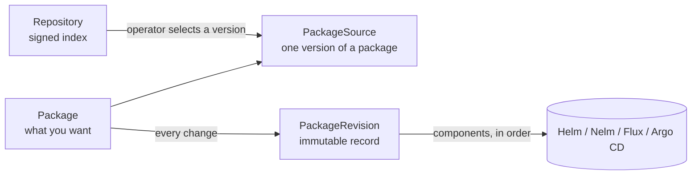

# Concepts

## Packages and components

A **package** is something you install and upgrade as one unit, such as cert-manager, KubeVirt or your own application. A package is made of **components**. Each component is one Helm chart, installed as one release into one namespace. KubeVirt, for example, has two components: the operator, and the `KubeVirt` resource that tells the operator to deploy. The second must wait until the first is running.

A package has a semver **version**, and every version can declare:

- **requirements**: other packages, with version constraints (`cert-manager >=1.20 <2`), or **capabilities** (`api:monitoring.coreos.com/v1`) that some package provides or that the cluster already serves;
- **conflicts**: packages or capabilities that must not be installed at the same time;
- the **CRDs** it owns;
- the **permissions** it needs, which plans show before you install;
- whether a **rollback** to the previous version is safe, or whether the new version changes data in ways the old one cannot read;
- **variants**: alternative sets of components and requirements, such as `default` and `ha`.

## The objects in the cluster

kubepkg keeps all its state in Kubernetes objects. All of them are cluster-scoped.

| Object | Who writes it | What it says |
|---|---|---|
| `Repository` | you, or the chart | subscribe to this index, trusting these keys |
| `Package` | you, through `kubepkg install` or GitOps | install this package, at a version matching this constraint, with these values |
| `PackageSource` | the operator, from a repository, or you by hand | this version of the package, its components and requirements |
| `PackageRevision` | the operator | revision N of the package was this exact set of charts and values, and this is how applying it went |

You change a `Package`, and the operator does the rest. It chooses a version from the repositories and writes it as the `PackageSource`. It then checks requirements, conflicts and CRD ownership. If the desired state differs from the current revision, it records a new `PackageRevision` and applies its components in dependency order.

A `PackageSource` you write by hand always wins over the repositories. That is how you pin a local build or patch one cluster.

## Revisions and rollback

A revision records what was applied: the version, the variant, and the digest of every chart and every set of values. It is never edited afterwards. The history only grows: a rollback to revision 1 creates revision 3 with revision 1's contents.

When a component fails to become ready within the upgrade timeout, kubepkg considers whether to roll back:

- If the package has `upgrade.atomic: true`, the default, **and** the version being left declares `rollback.safe: true`, every component already changed returns to the previous revision in reverse order. The package reports `UpgradeRolledBack`.
- Otherwise kubepkg stops and reports `UpgradeFailed`. Recovery is a forward fix: a corrected version, or a values change.

The version being left decides whether rolling back is safe, because its author knows whether it migrated data the old version cannot read.

## Repositories and recipes

A **repository** is a single `index.yaml` file served over HTTPS. It lists every version of every package, and each version pins its charts by digest. Charts live in any OCI registry. The index is signed, and the cluster accepts it only when the signatures match keys it trusts.

The people who maintain a repository build its packages from **recipes**. A recipe is a directory with `recipe.yaml`, which pins the upstream sources by checksum or digest and says how to turn them into charts: values, overlays, patches and plugin steps. `kubepkg build` turns a recipe into Helm charts in a registry, plus the `PackageSource` that installs them. `kubepkg repo index` collects those into the signed index. The same recipe always builds the same content.

## Capabilities

A capability is a name that stands for a feature rather than a package. A package `provides` capabilities, and others require them. Capabilities of the form `api:<group>/<version>` are also satisfied when the cluster already serves that API, so something installed outside kubepkg still counts. For example, a monitoring stack already installed in the cluster satisfies `api:monitoring.coreos.com/v1`.

## Meta packages

A package with requirements and no components is a **meta package**. It names a set of packages and their versions: a distribution, or a profile such as "virtualization". Installing it installs its members. Upgrading it moves each member to the version the new meta package requires.

## Hub and members

A **hub** cluster installs packages into **member** clusters. Each member runs kubepkg itself. The hub knows its members as `Cluster` objects with labels. A `PackageSet` says which repositories and packages go to the clusters that match a label selector. See [Several clusters](guides/multi-cluster.md).
