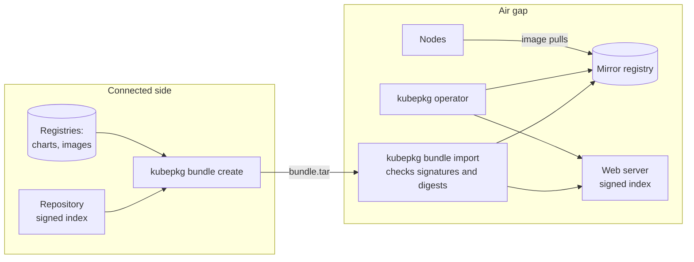

# Air-gapped clusters

Many clusters cannot reach the internet: government and defence installations, banks, industrial sites, sovereign clouds. kubepkg installs into them from a **bundle**, one file that carries the packages and everything they need. Inside the air gap the bundle is checked against the repository's signatures again before anything from it is used.



## What a bundle holds

- The repository files exactly as published: `index.yaml`, its signatures and, for a repository with a root of trust, every version of the root.
- The chart archives of the chosen packages and of everything they require.
- Package trees, for packages built from one.
- The container images the packages run.

Nothing in the bundle is trusted for its own sake. On import, kubepkg checks it with the repository keys **you** give, never keys the bundle carries. It applies the same checks a cluster does: signatures, the root chain and expiry. Then it checks every chart, tree and image against the digests the signed packages pin. A file swapped anywhere along the way is refused.

## 1. Pin images in your packages

A package lists the images it runs, each pinned by digest, in `package.images`. The signed index then covers images exactly as it covers charts:

```yaml
package:
  images:
    - quay.io/jetstack/cert-manager-controller:v1.21.2@sha256:70f532fd9cfde0b09d55687200942399d89838bc2d5d5b45152eb799a15912b8
    - quay.io/jetstack/cert-manager-webhook:v1.21.2@sha256:a60e2dac46dbb8a7f3df95c54ce941012f54c2fe022f0ee55aaa1ab40ed957ae
```

`kubepkg init` writes this list for a new recipe. For an existing one, `kubepkg images recipes/cert-manager` prints the block to paste in. `kubepkg validate` fails when a chart runs an image the list does not pin. Images that an operator deploys on its own, such as KubeVirt's `virt-handler`, appear in no chart, so add them by hand.

The pins live in the recipe for the same reason source digests do. If a build resolved tags itself, the same recipe would build a different package every time an upstream tag moved.

A package that pins no images can still be bundled. `bundle create` renders its charts, finds the images and pins them as they are at that moment. Only the bundle vouches for those images, so import refuses them unless you pass `--allow-unpinned-images`.

## 2. Make the bundle

On a machine with internet access:

```bash
curl -fsSLO https://raw.githubusercontent.com/kuberoot-dev/kubepkg-recipes/main/keys/index.pub
kubepkg bundle create virtualization cert-manager \
  --repo https://kuberoot-dev.github.io/kubepkg-recipes/index.yaml --public-key index.pub \
  -o platform-2026-10.tar
kubepkg bundle inspect platform-2026-10.tar
```

`create` resolves the packages and their requirements as `install` would for an empty cluster, so the bundle is complete. Without `--repo`, it takes the repositories of the cluster in your current context. For a repository with a root of trust, pass `--root-key` and `--root-threshold` instead of `--public-key`.

## 3. Import inside the air gap

You need an OCI registry, such as Harbor, Zot, `registry:2` or your cloud's own, and a web server for static files. Move the bundle across the gap, then:

```bash
kubepkg bundle import platform-2026-10.tar \
  --public-key index.pub \
  --mirror oci://registry.internal/kubepkg \
  --site /srv/www/packages \
  --node-config ./node-config
```

- `--public-key` (or `--root-key`) are the keys you trust. Bring them across the gap separately from the bundle, for example in your configuration management.
- `--mirror` is the registry path everything is copied into. Each location keeps its own place under it: `ghcr.io/org/packages/cdi` becomes `registry.internal/kubepkg/ghcr.io/org/packages/cdi`, and `quay.io/jetstack/cert-manager-controller` becomes `registry.internal/kubepkg/quay.io/jetstack/cert-manager-controller`. Copies keep their digests.
- `--site` receives each repository's files unchanged, `<site>/<repository>/index.yaml` and its signatures. Serve the directory over HTTP.
- `--node-config` writes the settings that make the nodes pull images from the mirror. See step 5.

Importing a newer bundle into the same mirror adds to it, and anything already there is skipped by digest.

## 4. Point kubepkg at the mirror

```yaml title="values.yaml"
mirror: oci://registry.internal/kubepkg
repositories:
  - name: main
    url: https://www.internal/packages/main/index.yaml
    publicKeys:
      - |
        -----BEGIN PUBLIC KEY-----
        ...
```

```bash
helm install kubepkg oci://registry.internal/kubepkg/ghcr.io/kuberoot-dev/charts/kubepkg \
  -n kubepkg-system --create-namespace -f values.yaml
```

With `mirror` set, the operator fetches every chart and package tree from the mirror and from nowhere else. Package specs keep their original locations, so revisions do not change when you turn the mirror on. The cluster checks the index served from your web server with the same keys, and checks every chart against its pinned digest.

kubepkg's own chart and operator image are artifacts like any other. Copy them into the mirror once, with `oras cp` or your registry's replication, or add them to the bundle from a repository that packages kubepkg itself.

## 5. Images on the nodes

Pods pull images through the container runtime, not through kubepkg. `--node-config` writes the runtime settings that redirect every registry the bundle carried to the mirror:

```text
node-config/
  containerd/certs.d/quay.io/hosts.toml      # one per registry: copy to /etc/containerd/certs.d/
  containerd/certs.d/docker.io/hosts.toml
  talos-registries.yaml                      # a machine config patch for Talos Linux
```

```toml title="containerd/certs.d/quay.io/hosts.toml"
server = "https://quay.io"

[host."https://registry.internal/v2/kubepkg/quay.io"]
  capabilities = ["pull", "resolve"]
  override_path = true
```

The charts keep referring to `quay.io/...`, and the nodes fetch those images from the mirror. Digests stay the same, so a pod that pins an image by digest gets exactly that image.

## Expiry

A repository with a root of trust signs its index with an expiry date. That is what protects clusters from a stale index replayed by a mirror, and inside an air gap it keeps working:

- `bundle import` refuses a bundle whose index has expired, so transfer bundles within the expiry period.
- In the cluster, an index that has expired is refused on refresh. The packages installed from it keep running, and the alert `KubepkgRepositoryNotLoaded` reminds you to bring a fresh bundle.

Choose the repository's `--expires` with your transfer cycle in mind. Plain-key repositories do not require an expiry.

## Checklist

- [ ] Every package in the bundle pins its images (`bundle inspect` shows `PINNED BY repository`).
- [ ] The repository keys came across the air gap separately from the bundle.
- [ ] kubepkg's own chart and image are in the mirror.
- [ ] Nodes pull through the mirror: containerd `hosts.toml` or the Talos patch is applied.
- [ ] The web server serves `<site>/<repository>/` over HTTP or HTTPS, and the chart's `repositories` point there.
