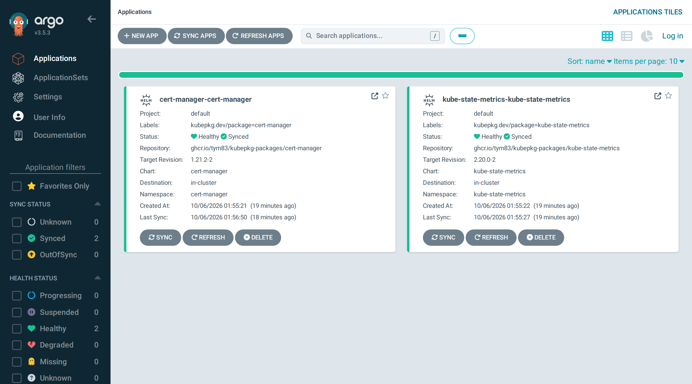

# Backends: Helm, werf, Flux, Argo CD

The operator decides *what* to install and in which order. A **backend** does the installing. Every backend gets a package's components one at a time, in dependency order, so ordering, requirements, `readyWhen`, hooks and revisions behave the same whichever you choose. The backends differ in who applies the manifests and whether a failed upgrade can be rolled back.

| | helm | werf | flux | argo |
|---|---|---|---|---|
| Applies manifests | the operator, with the Helm SDK | the operator, with Nelm | Flux's helm-controller | Argo CD |
| Whole-package rollback | yes | yes | no | no |
| Package trees (`sourceRef`) | yes | yes | no | no |
| Other controllers needed | none | none | Flux source and helm controllers | Argo CD |
| Operator permissions | cluster-admin | cluster-admin | its own role | its own role |
| Releases visible to | `helm list` | `nelm release list`, `helm list` | `flux get helmreleases` | the Argo CD UI |

Choose one per installation:

```bash
helm install kubepkg oci://ghcr.io/kuberoot-dev/charts/kubepkg -n kubepkg-system --create-namespace \
  --set backend=werf
```

## helm

The default. The operator installs each component with the Helm SDK in-process and waits until Helm's status checks pass. Rollback uses Helm's release history. Charts come from HTTP repositories, OCI registries and package trees, are verified against their digests, and are cached.

Use it when you want nothing else in the cluster.

## werf

[werf](https://werf.io)'s deployment engine is [Nelm](https://github.com/werf/nelm). It is built on a partly rewritten Helm codebase, works with the same charts and releases, and adds better tracking of resource state and errors, finer ordering of resources within a release, and improved CRD handling. With `backend: werf`, the operator prepares and verifies charts exactly as for `helm` and runs `nelm release install` for each component. The `nelm` binary ships in the operator image, pinned by checksum.

Nelm keeps Helm-compatible release history, so this backend rolls back like `helm`. `helm list` and `nelm release list` both show its releases.

Use it when your team already works with werf, or when Nelm's resource tracking and error reports would help with packages whose upgrades are hard to follow.

!!! note
    werf itself deploys one release per project into one namespace, while a kubepkg package is often several releases in several namespaces. That is why kubepkg integrates with werf as a backend that runs Nelm once per component, not by writing a werf project. A werf project can still use kubepkg's published charts as ordinary chart dependencies.

## flux

With `backend: flux`, each component becomes a Flux source and a `HelmRelease`:

- an `OCIRepository` that selects the Helm chart layer, for charts in an OCI registry;
- a `HelmRepository`, for charts in an HTTP repository;
- a `HelmRelease` with the component's values, labelled `kubepkg.dev/package`.

The operator waits for each `HelmRelease` to be ready before writing the next one. Uninstalling a component deletes both objects, and Flux removes what it deployed. Only Flux's source and helm controllers are needed. The operator runs without cluster-admin, because Flux applies the manifests.

```bash
helm install kubepkg oci://ghcr.io/kuberoot-dev/charts/kubepkg -n kubepkg-system --create-namespace \
  --set backend=flux --set clusterAdmin=false
```

Limitations:

- Flux keeps no earlier chart artifacts, so this backend **cannot roll back**. A failed upgrade reports `UpgradeFailed`, and recovery is a forward fix.
- Package trees cannot be handed to Flux. Packages must use published charts, which every package built with `kubepkg build` does.
- Flux reads the platform values Secret only from the release's namespace.

## argo

With `backend: argo`, each component becomes an automatically synced Argo CD `Application` in `argo.namespace` (default `argocd`) and `argo.project`:

```bash
helm install kubepkg oci://ghcr.io/kuberoot-dev/charts/kubepkg -n kubepkg-system --create-namespace \
  --set backend=argo --set clusterAdmin=false \
  --set argo.namespace=argocd --set argo.project=default
```

A component is ready once Argo CD reports the wanted chart version as synced and healthy. Deleting a component deletes its Application, and Argo CD removes what it deployed. Argo CD cannot read values from Secrets, so the operator passes platform and package values to it inline.



Like flux, this backend cannot roll back a whole package.

## Writing your own

A backend is a Go type with four methods:

```go
type Backend interface {
	Name() string
	Apply(ctx context.Context, c Component) (State, error)
	Status(ctx context.Context, c Component) (State, error)
	Rollback(ctx context.Context, c Component, toRevision int) (State, error)
	Uninstall(ctx context.Context, c Component) error
}
```

A distribution registers it by name in `operator.Options.Backends` and builds its own operator binary. See [Embedding in a platform](embedding.md#go-libraries). The werf backend in `pkg/backend/werf` is a short, complete example of a backend that drives an external tool.
