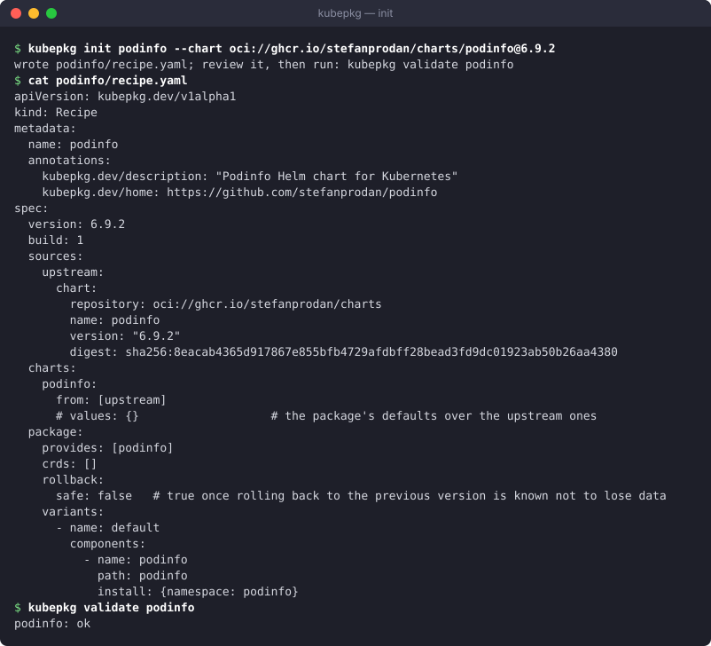

# Building packages

The packages in a repository are built by its maintainers from upstream sources, the way Debian builds `.deb` files from upstream tarballs. What the upstream ships does not matter: release manifests, a Helm chart, or a source archive with a chart somewhere inside. Each becomes an ordinary Helm chart in your registry, pinned by digest, and installing it never contacts the upstream again.

A **recipe** says how to build one package. It is a directory with `recipe.yaml`, plus any charts, overlays or patches you maintain next to it.

## Starting a recipe

`kubepkg init` downloads the upstream, pins it, and writes a first recipe:

```bash
# from a published chart
kubepkg init recipes/podinfo --chart oci://ghcr.io/stefanprodan/charts/podinfo@6.9.2
kubepkg init recipes/cert-manager --chart https://charts.jetstack.io/cert-manager@v1.21.2

# from release manifests
kubepkg init recipes/kubevirt --version 1.9.0 \
  --manifest https://github.com/kubevirt/kubevirt/releases/download/v1.9.0/kubevirt-operator.yaml
```



`init` takes the description from the chart and drops `Namespace` objects from manifests, because kubepkg creates namespaces itself. It also lists the CRDs the upstream ships, because a package must declare the CRDs it owns. Review the result. It is a starting point, not a finished package.

## The recipe

```yaml title="recipes/kubevirt/recipe.yaml"
apiVersion: kubepkg.dev/v1alpha1
kind: Recipe
metadata:
  name: kubevirt
  annotations:
    kubepkg.dev/description: Virtual machines on Kubernetes
    kubepkg.dev/home: https://kubevirt.io
spec:
  version: 1.9.0          # the upstream version
  build: 4                # our fourth packaging of it
  sources:                # every source is pinned
    operator:
      url: https://github.com/kubevirt/kubevirt/releases/download/v1.9.0/kubevirt-operator.yaml
      sha256: f11307caafc3c23ffedf9887d8beb5a4419e2694da242fa68f63d1ec820de2e0
    kubevirt:
      dir: charts/kubevirt  # a chart we maintain, next to the recipe
  charts:                 # what goes into the package
    kubevirt-operator:
      from: [operator]    # plain manifests are wrapped into a chart
      exclude: [{kind: Namespace}]
      patches:
        # Upstream requires control-plane nodes for virt-operator; clusters
        # with a hosted control plane have none.
        - kind: Deployment
          name: virt-operator
          merge:
            spec:
              template:
                spec:
                  affinity:
                    nodeAffinity:
                      requiredDuringSchedulingIgnoredDuringExecution: null
    kubevirt:
      from: [kubevirt]    # a chart source is used as is
  package:                # the PackageSource: what the operator installs
    provides: [kubevirt, "api:kubevirt.io/v1"]
    crds: [kubevirts.kubevirt.io]
    rollback: {safe: false}
    variants:
      - name: default
        requires:
          - {package: cdi, optional: true}
        components:
          - name: operator
            path: kubevirt-operator
            install: {namespace: kubevirt}
          - name: kubevirt
            path: kubevirt
            install:
              namespace: kubevirt
              dependsOn: [operator]
              readyWhen:
                - {apiVersion: kubevirt.io/v1, kind: KubeVirt, name: kubevirt, condition: Available}
```

### Sources

| Source | Is |
|---|---|
| `url` + `sha256` | a file, or a `.tar.gz`/`.tgz` archive; `path` selects a file or directory inside the archive |
| `chart` | a published Helm chart (`repository`, `name`, `version`, `digest`) in an HTTP repository or an OCI registry |
| `dir` | a directory next to the recipe, for charts and manifests you maintain |
| `plugin` + `with` | fetched by a source plugin, for example from git or an internal artifact store |

Everything is checked against its checksum or digest. A changed upstream file fails the build instead of changing the package.

### Charts

A chart is made either from **one chart source**, used as is, or from **manifests**: one or more sources of plain YAML, wrapped into a chart that applies them verbatim. Their content never passes through the template engine, so `{{` in a ConfigMap stays `{{`. On top of that:

- `values` set the package's defaults, merged over the chart's `values.yaml`. Users can still override them;
- `overlay: dir` adds or replaces files in the chart, for changes values cannot express;
- `exclude` drops objects from wrapped manifests;
- `patches` change objects of wrapped manifests with JSON merge patches, where `null` removes a field. This is how a Debian package patches its upstream. A patch that matches no object fails the build, so an upstream rename cannot silently ship an object unpatched;
- `steps` run step plugins on the finished chart.

### The package

`package` is the `PackageSource` spec the operator installs: `provides`, `conflicts`, `crds`, `permissions`, `rollback` and `variants` with their components. Components refer to built charts by `path`, the chart's name under `charts`. The build fills in the version and the digests. See [Upgrades, readiness and hooks](upgrades.md) for `dependsOn`, `readyWhen`, `phase: PreUpgrade` and `rollback.safe`, and the [recipe reference](../reference/recipe.md) for every field.

## Validating

```bash
kubepkg validate recipes/kubevirt recipes/cert-manager
```

`validate` builds without publishing. It renders every chart with its defaults and checks the package against what the charts contain. A CRD that a chart ships but the package does not declare is an error, because a CRD nobody owns is a CRD two packages can fight over. Run it on every pull request.

## Building and publishing

```bash
kubepkg build recipes/kubevirt --registry oci://ghcr.io/example/packages -o dist
```

`build` fetches and checks the sources, builds the charts, and pushes each one as an ordinary Helm OCI chart: `oci://ghcr.io/example/packages/kubevirt/kubevirt-operator:1.9.0-4`. It writes `dist/kubevirt-1.9.0-4.yaml`, the `PackageSource` that installs those charts by digest. `kubepkg repo index dist` turns such files into the repository index. See [Repositories and trust](repositories.md#publishing-a-repository).

Because built packages are plain Helm charts, Helm, Flux, Argo CD and werf can install them without kubepkg:

```bash
helm install kubevirt-operator oci://ghcr.io/example/packages/kubevirt/kubevirt-operator --version 1.9.0-4
```

### Versions, builds and immutability

`spec.version` is the upstream version, and `spec.build` numbers your packagings of it. Fixing a packaging bug means `build: 5`, with the same upstream version. Constraints match the upstream version. Of two builds, the higher is newer.

The same recipe always builds the same content. A package's identity is that content: the digest of its uncompressed chart files, recorded on the artifact as `dev.kubepkg.content.digest`. Compressed bytes differ between compressors and Go versions, so identity does not depend on them. Tags are immutable:

- if the tag already holds the same content, the published artifact is reused, so rebuilding an unchanged recipe on another machine publishes nothing new;
- if the content differs under the same version and build, the build fails. Bump `build`.

## Plugins

A distribution extends builds without changing kubepkg. A **source plugin** fetches a source:

```yaml
sources:
  app:
    plugin: git
    with: {url: https://git.example.org/app.git, commit: 3f1c2e9, path: deploy/chart}
```

A **step plugin** changes a finished chart, for example to move images to the distribution's registry:

```yaml
charts:
  app:
    from: [app]
    steps:
      - plugin: relocate-images
        with: {registry: registry.example.org/mirror}
```

A plugin is either Go code registered in `build.Options.Plugins`, or an executable on `PATH` named `kubepkg-source-<name>` or `kubepkg-step-<name>`, written in any language. An executable plugin:

- reads `with` as JSON on standard input;
- gets its directories from the environment: `KUBEPKG_OUT`, an empty directory a source plugin fills, or `KUBEPKG_CHART`, the chart a step plugin changes;
- learns the package from `KUBEPKG_PACKAGE` and `KUBEPKG_VERSION`;
- runs in the recipe directory, and fails the build by exiting with a non-zero status.

```bash title="kubepkg-step-set-registry"
#!/usr/bin/env bash
# Points the chart's images at the distribution's registry.
set -euo pipefail
registry=$(jq -r .registry)
yq -i ".image.registry = \"${registry}\"" "${KUBEPKG_CHART}/values.yaml"
```

Plugins must be deterministic. A plugin that fetches "latest" or stamps the time breaks reproducible builds, and with them the immutability checks.

## A repository of recipes in CI

[tym83/kubepkg-recipes](https://github.com/tym83/kubepkg-recipes) is a complete example:

- `recipes/<name>/recipe.yaml` for each package;
- on every pull request, `kubepkg validate` runs for every recipe;
- on every merge, `scripts/build-all.sh` builds every recipe into `ghcr.io/tym83/kubepkg-packages`, merges the index with the published one, signs it with a key from a repository secret, and publishes it to GitHub Pages.

Fork it, point `REGISTRY` at your registry, generate a key with `kubepkg repo keygen`, store the private key as the `KUBEPKG_SIGNING_KEY` secret, and you have a package repository.
