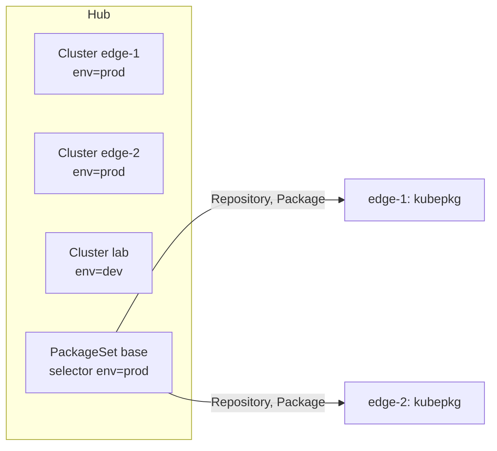

# Several clusters

With many clusters, you want to say "every production cluster runs cert-manager 1.21 and virtualization 1.0" once, not once per cluster. A kubepkg **hub** does that. The hub is a cluster that knows its **members** and writes `Repository` and `Package` objects into them. Each member runs kubepkg itself, so revisions, rollbacks and readiness stay local to the member and keep working when the hub is away.



## 1. Install kubepkg everywhere

The hub and every member run the same operator:

```bash
helm install kubepkg oci://ghcr.io/tym83/charts/kubepkg -n kubepkg-system --create-namespace
```

On the members, the repositories can come from the hub, so nothing else needs configuring.

## 2. Register the members

```bash
kubepkg --context hub cluster add edge-1 --kubeconfig edge-1.kubeconfig --label env=prod --label region=eu
kubepkg --context hub cluster add edge-2 --kubeconfig edge-2.kubeconfig --label env=prod --label region=us
kubepkg --context hub cluster list
```

`cluster add` keeps only the member's context from the kubeconfig, with its credentials inlined, and stores it in a Secret in the hub's `kubepkg-system`. It then creates a `Cluster` object that points at the Secret and carries the labels. The hub checks every minute that it can reach each member and that the member runs kubepkg, and records the member's Kubernetes version:

```text
--8<-- "examples/cluster-list.txt"
```

The kubeconfig is the hub's access to the member, so give it only what the hub needs. The hub reads and writes `Repository` and `Package` objects in the `kubepkg.dev` group, and nothing else:

```yaml
apiVersion: rbac.authorization.k8s.io/v1
kind: ClusterRole
metadata:
  name: kubepkg-hub
rules:
  - apiGroups: [kubepkg.dev]
    resources: [repositories, packages]
    verbs: [get, list, watch, create, update, patch, delete]
```

Bind that role to a ServiceAccount in the member, and build the kubeconfig from the ServiceAccount's token.

## 3. Say what goes where

```yaml
apiVersion: kubepkg.dev/v1alpha1
kind: PackageSet
metadata:
  name: base
spec:
  clusterSelector:
    matchLabels: {env: prod}
  repositories:
    - name: main
      spec:
        url: https://tym83.github.io/kubepkg-recipes/index.yaml
        publicKeys:
          - |
            -----BEGIN PUBLIC KEY-----
            ...
            -----END PUBLIC KEY-----
  packages:
    - name: cert-manager
      spec:
        version: "~1.21"
    - name: virtualization
      spec:
        version: "~1.0"
    - name: kubevirt
    - name: cdi
```

Each entry's `spec` is a full `Repository` or `Package` spec, values included. As in GitOps, list the requirements too: each member's operator checks requirements but never installs them on its own.

The hub then:

- writes each repository and package to every cluster the selector matches, labelled `kubepkg.dev/package-set: base`;
- **never touches an object it did not create.** If a member already has a `cert-manager` Package made by hand, the set reports a conflict for that cluster and leaves the Package alone;
- removes a package from the members when you drop it from the set;
- removes everything the set wrote from a cluster that stops matching the selector, for example when you relabel it `env=dev`;
- when you delete the set, removes everything it wrote. It waits for unreachable members rather than leave their packages behind, so deletion completes only once every member has been cleaned up.

## 4. Watch it converge

```bash
kubepkg --context hub set list
kubectl --context hub get packagesets
```

```text
--8<-- "examples/set-list.txt"
```

`READY` counts the set's packages that are ready on each cluster. The set is `Ready` once every selected cluster has all its packages ready. For details on one cluster, look at the member itself:

```bash
kubepkg --context edge-1 list
kubepkg --context edge-1 history cert-manager
```

## Rolling out a change carefully

By default a change to a set, such as a new version constraint, new values or another package, reaches every selected cluster at once. `rollout` paces it:

```yaml
spec:
  rollout:
    canary: {matchLabels: {ring: canary}}   # these clusters first
    maxInProgress: 2                        # then two clusters at a time
    pauseOnFailure: true                    # the default
```

- **Canary clusters** take a change first. The others follow only once every canary is done with it, meaning every package there is ready with the change.
- **maxInProgress** bounds how many clusters may be taking a change at once. A cluster counts as in progress from the moment it gets the change until all its packages are ready with it.
- **pauseOnFailure** stops the change from reaching more clusters as soon as a cluster that took it reports a failed or rolled-back upgrade. The set reports `RolloutPaused` and names the cluster and the reason. Clusters that already took the change keep it, and each one's own revision history and rollback protect it. Fixing the set, for example with a corrected version or values, is a new change, and the rollout resumes with it.

A cluster that joins the set later takes the current change through the same gates.

The hub paces changes **to the set**. A package whose constraint allows newer versions, such as `~1.21`, moves on every cluster on its own as the repository gains them. To roll versions out in waves, pin versions in the set, exact or tight, and change them in the set.

## Seeing where every cluster is

```bash
kubepkg set status base
```

```text
prod: 2 of 2 clusters ready

CLUSTER  UPDATED  KUBE-STATE-METRICS
self     yes      2.20.0
edge     yes      2.20.0
```

While a rollout is paused after a failure, the same command shows where it stopped. Here the canary `self` took a broken change and rolled it back, and `edge` never got it:

```text
prod: 0 of 2 clusters ready, 1 updated
rollout paused: stopped after a failure on self: kube-state-metrics: revision 3 failed (component kube-state-metrics failed: upgrade …

CLUSTER  UPDATED  KUBE-STATE-METRICS
self     yes      2.20.0
edge     no       2.20.0
```

`set status` prints the version of each package on every cluster. A version that differs from the most common one is marked `*`, and a dash means the package is not installed there yet. The outputs above come from a hub that registers itself as the canary `self` next to a member `edge` (`test/e2e/fleet.sh`).

## Moving clusters between sets

When a cluster leaves one set and another set takes it, packages and repositories that both sets carry are **handed over, not reinstalled**. The object stays, changes owner, and then follows the new set's spec and rollout. This works whichever set the hub reconciles first. Only what no set wants any more is removed, and removing it uninstalls it.

## Things to know

- The hub needs to reach the members' API servers. Members do not need to reach the hub.
- Deleting a set removes what it wrote, except objects another set takes over. The deletion waits for unreachable members.
