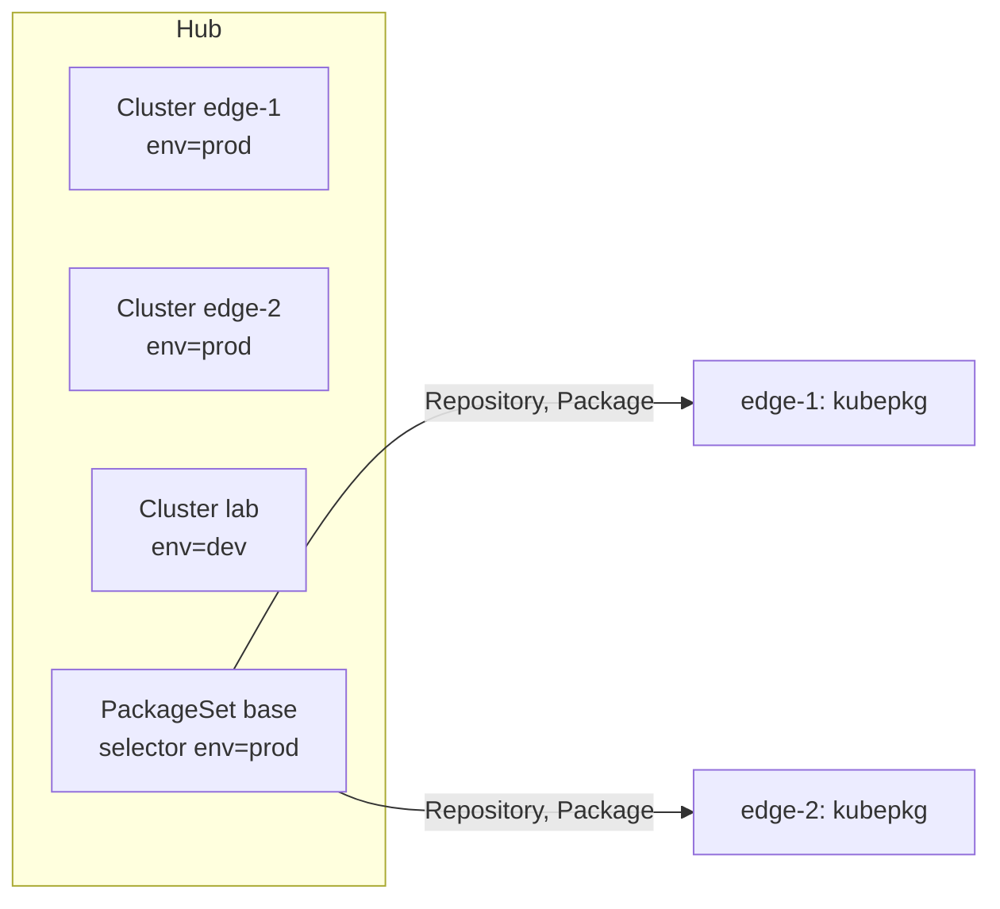

# Several clusters

With many clusters, you want to say "every production cluster runs cert-manager 1.21 and virtualization 1.0" once, not once per cluster. A kubepkg **hub** does that. The hub is a cluster that knows its **members** and writes `Repository` and `Package` objects into them. Each member runs kubepkg itself, so revisions, rollbacks and readiness stay local to the member and keep working when the hub is away.



## 1. Install kubepkg everywhere

The hub and every member run the same operator:

```bash
helm install kubepkg oci://ghcr.io/tym83/charts/kubepkg -n kubepkg-system --create-namespace
```

On the members, the repositories can come from the hub, so nothing else needs configuring.

## 2. Register the members

```bash
kubepkg --context hub cluster add edge-1 --kubeconfig edge-1.kubeconfig --label env=prod --label region=eu
kubepkg --context hub cluster add edge-2 --kubeconfig edge-2.kubeconfig --label env=prod --label region=us
kubepkg --context hub cluster list
```

`cluster add` keeps only the member's context from the kubeconfig, with its credentials inlined, and stores it in a Secret in the hub's `kubepkg-system`. It then creates a `Cluster` object that points at the Secret and carries the labels. The hub checks every minute that it can reach each member and that the member runs kubepkg, and records the member's Kubernetes version:

```text
--8<-- "examples/cluster-list.txt"
```

The kubeconfig is the hub's access to the member, so give it only what the hub needs. The hub reads and writes `Repository` and `Package` objects in the `kubepkg.dev` group, and nothing else:

```yaml
apiVersion: rbac.authorization.k8s.io/v1
kind: ClusterRole
metadata:
  name: kubepkg-hub
rules:
  - apiGroups: [kubepkg.dev]
    resources: [repositories, packages]
    verbs: [get, list, watch, create, update, patch, delete]
```

Bind that role to a ServiceAccount in the member, and build the kubeconfig from the ServiceAccount's token.

## 3. Say what goes where

```yaml
apiVersion: kubepkg.dev/v1alpha1
kind: PackageSet
metadata:
  name: base
spec:
  clusterSelector:
    matchLabels: {env: prod}
  repositories:
    - name: main
      spec:
        url: https://tym83.github.io/kubepkg-recipes/index.yaml
        publicKeys:
          - |
            -----BEGIN PUBLIC KEY-----
            ...
            -----END PUBLIC KEY-----
  packages:
    - name: cert-manager
      spec:
        version: "~1.21"
    - name: virtualization
      spec:
        version: "~1.0"
    - name: kubevirt
    - name: cdi
```

Each entry's `spec` is a full `Repository` or `Package` spec, values included. As in GitOps, list the requirements too: each member's operator checks requirements but never installs them on its own.

The hub then:

- writes each repository and package to every cluster the selector matches, labelled `kubepkg.dev/package-set: base`;
- **never touches an object it did not create.** If a member already has a `cert-manager` Package made by hand, the set reports a conflict for that cluster and leaves the Package alone;
- removes a package from the members when you drop it from the set;
- removes everything the set wrote from a cluster that stops matching the selector, for example when you relabel it `env=dev`;
- when you delete the set, removes everything it wrote. It waits for unreachable members rather than leave their packages behind, so deletion completes only once every member has been cleaned up.

## 4. Watch it converge

```bash
kubepkg --context hub set list
kubectl --context hub get packagesets
```

```text
--8<-- "examples/set-list.txt"
```

`READY` counts the set's packages that are ready on each cluster. The set is `Ready` once every selected cluster has all its packages ready. For details on one cluster, look at the member itself:

```bash
kubepkg --context edge-1 list
kubepkg --context edge-1 history cert-manager
```

## Things to know

- The hub writes the same spec to every selected cluster at once. Staged rollouts across clusters are on the roadmap. Until then, change a set's version when you are ready for all of its clusters to move.
- Removing a package from a cluster uninstalls it, whether you drop the package from the set, relabel the cluster out of the selector, or delete the set. Moving a cluster from one set to another set that carries the same package therefore uninstalls it and installs it again. Prefer changing a set's contents over moving clusters between sets that overlap.
- The hub needs to reach the members' API servers. Members do not need to reach the hub.
