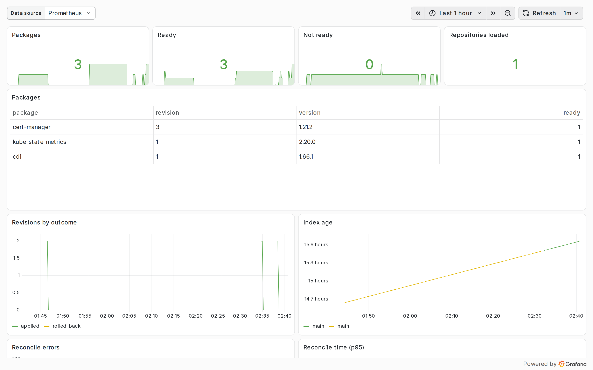

# Monitoring

The operator exports Prometheus metrics. The chart can add a ServiceMonitor, alerts and a Grafana dashboard.



## Turning it on

With the Prometheus Operator, or anything that understands its CRDs, such as kube-prometheus-stack or VictoriaMetrics:

```bash
helm upgrade kubepkg oci://ghcr.io/tym83/charts/kubepkg -n kubepkg-system --reuse-values \
  --set metrics.serviceMonitor.enabled=true \
  --set metrics.prometheusRule.enabled=true \
  --set metrics.dashboard.enabled=true
```

- `metrics.serviceMonitor` scrapes the operator every 30 seconds. Add `labels` if your Prometheus selects ServiceMonitors by label, for example `release: kube-prometheus-stack`.
- `metrics.prometheusRule` installs the alerts below.
- `metrics.dashboard` puts the dashboard in a ConfigMap labelled `grafana_dashboard: "1"`, which Grafana's dashboard sidecar picks up.

Without the Prometheus Operator, scrape the Service `kubepkg-metrics` on port 8080, path `/metrics`.

## Metrics

| Metric | Type | Meaning |
|---|---|---|
| `kubepkg_package_ready{package}` | gauge | 1 when the package is ready, 0 otherwise |
| `kubepkg_package_info{package,version,revision}` | gauge | always 1; the labels carry the version and revision a package runs |
| `kubepkg_revisions_total{package,outcome}` | counter | revisions by outcome: `applied`, `failed`, `rolled_back` |
| `kubepkg_repository_ready{repository}` | gauge | 1 when the repository's index is loaded and accepted |
| `kubepkg_repository_index_generated_timestamp_seconds{repository}` | gauge | when the accepted index was built |

controller-runtime's own metrics come from the same endpoint. The kubepkg controllers are named `kubepkg-package`, `kubepkg-repository`, `kubepkg-cluster` and `kubepkg-package-set`.

Useful queries:

```promql
# packages that are not ready
kubepkg_package_ready == 0

# which version of cert-manager each cluster runs (with a cluster label from your Prometheus setup)
kubepkg_package_info{package="cert-manager"}

# failed and rolled back upgrades over the last day
increase(kubepkg_revisions_total{outcome=~"failed|rolled_back"}[1d]) > 0
```

## Alerts

| Alert | Fires when | Severity |
|---|---|---|
| `KubepkgPackageNotReady` | a package has not been ready for 15 minutes | warning |
| `KubepkgUpgradeFailed` | a revision failed or was rolled back in the last 30 minutes | warning |
| `KubepkgRepositoryNotLoaded` | a repository's index has not been accepted for 30 minutes | warning |
| `KubepkgRepositoryStale` | a repository's accepted index is older than `metrics.prometheusRule.indexMaxAge` (default one week) | info |
| `KubepkgReconcileErrors` | a kubepkg controller has been failing to reconcile for 15 minutes | warning |

`KubepkgRepositoryStale` matters most for repositories whose indexes expire. Set `indexMaxAge` below the expiry the repository signs with, so a stuck publishing pipeline is noticed before clusters refuse its index.

## The dashboard

The dashboard shows:

- the number of packages, and how many are ready and not ready;
- how many repositories are loaded;
- a table of packages with version, revision and readiness;
- revisions over time by outcome;
- the age of each repository's index;
- reconcile errors and reconcile time per controller.

## Without Prometheus

Everything the metrics say is also in the objects:

```bash
kubectl get packages              # READY, VERSION, REVISION
kubectl get repositories          # URL, PRIORITY, PACKAGES, READY
kubectl describe package cert-manager   # conditions and revision history
```
