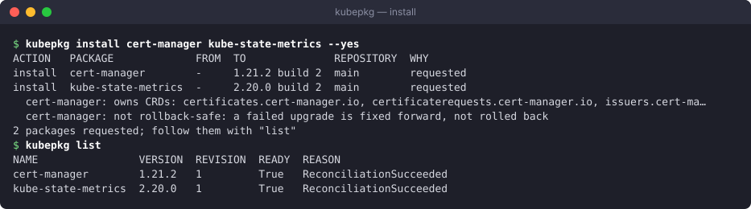
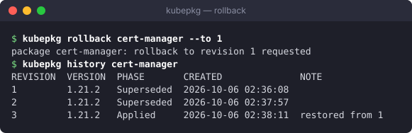

# Installing and upgrading packages

## The Package object

Everything you ask of kubepkg is a `Package`. `kubepkg install` writes these objects for you. You can also write them yourself and keep them in Git like any other manifest:

```yaml
apiVersion: kubepkg.dev/v1alpha1
kind: Package
metadata:
  name: cert-manager          # the package name
spec:
  version: "~1.21"            # semver constraint; empty accepts any version
  variant: default            # which variant of the package
  repository: ""              # only this Repository; empty means all of them, by priority
  components:                 # per-component settings, by component name
    cert-manager:
      values:
        replicaCount: 2
        prometheus: {servicemonitor: {enabled: true}}
  upgrade:
    atomic: true              # roll the whole package back on failure, when that is safe
    timeout: 10m              # how long each component has to become ready
  revisionHistoryLimit: 10    # PackageRevisions to keep
  crdPolicy: Retain           # Retain or Delete the package's CRDs on removal
```

## Choosing versions

`spec.version` is the policy for upgrades:

| Constraint | Means |
|---|---|
| `1.21.2` | exactly this version; the package never moves on its own |
| `~1.21` | any 1.21.x; the package follows patch releases as the repository gains them |
| `^1` or `>=1.20 <2` | any 1.x from 1.20 on |
| empty | the newest version in the repository |

`kubepkg install cert-manager` with no constraint writes `~X.Y` of the newest version, so the package follows patch releases but not minor ones. `kubepkg install cert-manager@1.21.2` pins it. When the operator refreshes a repository and finds a newer version that matches, it upgrades the package.

Several builds of one upstream version are possible, for example `1.9.0` build 1 and build 4. A higher build is newer. Constraints match the upstream version only.

## Plan, install, remove

```bash
kubepkg plan virtualization cert-manager@~1.21     # resolve and show; changes nothing
kubepkg install virtualization cert-manager@~1.21  # show the same plan, ask, then write Packages
kubepkg install virtualization --yes               # without asking, for scripts
kubepkg remove virtualization --autoremove --yes
```

`install` resolves the named packages together with everything they require, against the repositories the cluster is subscribed to. Requirements that are already installed and satisfied are kept as they are. Packages pulled in only as requirements are marked with the `kubepkg.dev/dependency` annotation. `remove --autoremove` uses that mark to remove requirements nothing needs any more. `remove` refuses to remove a package while a package that stays requires it, directly or as the only provider of a capability.


## Values

Each component's values are merged in this order, later ones winning:

1. the chart's own `values.yaml`;
2. the platform values Secret, when the operator has one (`valuesSecret` in the chart);
3. the package's defaults, set in the recipe or in the `PackageSource` component's `values`;
4. your values in `Package.spec.components.<name>.values`.

To change values, edit the Package:

```bash
kubectl patch package cert-manager --type merge \
  -p '{"spec":{"components":{"cert-manager":{"values":{"replicaCount":2}}}}}'
```

To turn off one component of a package, use `components.<name>.enabled: false`. This is useful for an optional part, such as a dashboard bundled with a tool.

## Watching what happens

```bash
kubepkg list                    # every package: version, revision, readiness
kubepkg history cert-manager    # its revisions
kubectl get packages            # the same, from kubectl
kubectl describe package cert-manager
```



When a package is not ready, its `Ready` condition says why:

| Reason | Means | What to do |
|---|---|---|
| `Progressing` | a revision is being applied | wait |
| `RequirementsNotMet` | a required package is missing or not ready; the message names it | install it, or wait for it |
| `VersionMismatch` | the hand-written PackageSource does not satisfy `spec.version` | fix one of them |
| `VersionNotAvailable` | no repository offers a matching version, or the repository has not loaded yet | check `kubepkg search` and `kubectl get repositories` |
| `Conflict` | an installed package conflicts with this one | remove one of them |
| `CRDOwnershipConflict` | another package owns a CRD this one ships | remove the other package, or drop the CRD from one of them |
| `VariantNotFound` | the package has no such variant | fix `spec.variant` |
| `UpgradeRolledBack` | the last upgrade failed and the package went back to the previous revision | read the message, fix, apply again |
| `UpgradeFailed` | the last upgrade failed and could not be rolled back | fix forward: a corrected version or values |

## Rolling back by hand

```bash
kubepkg history cert-manager
kubepkg rollback cert-manager            # to the revision before the current one
kubepkg rollback cert-manager --to 1     # to a given revision
```

A rollback re-applies the recorded state of that revision as a new revision: the same charts and the same values. The package then stays at that state, even though the Package object may still ask for something else. It moves forward again on the next change to what the Package resolves to: an edit to the Package, or a newer matching version in a repository. If you want to stay where you rolled back to, make the Package say so: pin the version, or revert the values.



## Pinning a package locally

A `PackageSource` written by hand overrides the repositories for that package. Use one to install a build that is not in any repository, or to patch one cluster:

```bash
kubectl apply -f my-cert-manager-source.yaml   # kind: PackageSource, metadata.name: cert-manager
```

The operator never replaces a `PackageSource` it did not write. To go back to the repositories, delete the hand-written source.

## Ignoring a requirement

Sometimes you know better than the package. For example, a requirement may be satisfied by something kubepkg cannot see. `spec.ignoreDependencies: [name]` skips that requirement for this package. Use it sparingly: kubepkg can no longer order the installation or check the requirement for you.
