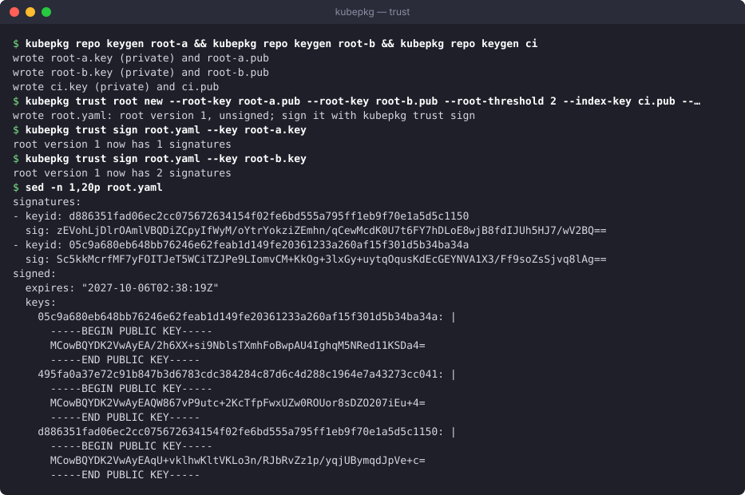

# Repositories and trust

A repository is one file, `index.yaml`, served over HTTP(S). It lists every version of every package the repository offers. Each version carries its full `PackageSource` spec, with every chart pinned by digest. The charts themselves live in an OCI registry. Because the index pins everything, its signature covers everything the repository installs.

## Subscribing a cluster

```bash
kubepkg repo add main https://packages.example.org/index.yaml --public-key release.pub
kubepkg repo add vendor https://vendor.example.com/index.yaml --public-key vendor.pub --priority 20
kubepkg repo list
kubepkg repo remove vendor
```

`repo add` creates a `Repository` object. You can also write one yourself, or list repositories in the chart's values:

```yaml
apiVersion: kubepkg.dev/v1beta1
kind: Repository
metadata:
  name: main
spec:
  url: https://packages.example.org/index.yaml
  priority: 10        # higher wins, see below
  interval: 10m       # how often the operator refreshes the index
  publicKeys:
    - |
      -----BEGIN PUBLIC KEY-----
      MCowBQYDK2VwAyEA...
      -----END PUBLIC KEY-----
```

```text
--8<-- "examples/repo-add.txt"
```

The `Ready` condition of a repository has one of these reasons:

| Reason | Means |
|---|---|
| `IndexLoaded` | the index was fetched, verified and accepted |
| `FetchFailed` | the index could not be downloaded; the one accepted before stays in use |
| `InvalidIndex` | the file is not a valid index |
| `IndexRefused` | a signature is missing or wrong, the index or root has expired, or the index is older than one already accepted |

A refused or failed refresh never removes packages. The index accepted before stays in use until a valid newer one arrives.

## Which repository a package comes from

When several repositories carry the same package, the one with the highest `priority` supplies it, **even when it has no version matching your constraint**. Without that rule, a package your vendor's repository carries could silently come from a community repository just because the community had a newer number. Within the chosen repository, the newest version and build matching the constraint wins.

To take a package from one particular repository, set `Package.spec.repository`. To take it from nowhere but your own build, write a `PackageSource` by hand.

After a restart, the operator chooses no versions until every repository has been fetched once. Otherwise a low-priority index that happened to load first could win for a moment.

## Publishing a repository

Your repository needs two places:

- an **OCI registry** for the charts, such as GitHub Container Registry, Harbor, Zot or a cloud registry;
- a **static web host** for `index.yaml` and its signatures, such as GitHub Pages, S3 or nginx.

The usual flow, for example in CI:

```bash
# 1. build every recipe; each writes dist/<pkg>-<version>-<build>.yaml
for r in recipes/*/; do
  kubepkg build "$r" --registry oci://ghcr.io/example/packages -o dist
done

# 2. index them, keeping what was published before, signed
kubepkg repo index dist -o site/index.yaml \
  --merge https://packages.example.org/index.yaml \
  --sign-key-env KUBEPKG_SIGNING_KEY

# 3. publish site/ (index.yaml, index.yaml.sig) to the web host
```

`repo index` enforces what makes a repository trustworthy:

- every version is an exact semver version and is defined once;
- every chart is pinned by digest. Charts without one are downloaded and pinned in the index, and `--verify` downloads pinned charts again to check them;
- with `--merge`, versions published before are kept even when their recipes are gone. A version rebuilt under the same version and build must come out identical: **published versions never change**. A changed recipe needs a new build number.

The repository in [tym83/kubepkg-recipes](https://github.com/tym83/kubepkg-recipes) does exactly this from GitHub Actions. Copy its `scripts/build-all.sh` and workflow as a starting point.

## Signing with plain keys

The simple mode uses one or more ed25519 keys. A cluster accepts an index signed by any key it trusts.

```bash
kubepkg repo keygen release                        # release.key (private), release.pub
kubepkg repo index dist --sign-key release.key     # writes index.yaml and index.yaml.sig
kubepkg repo add main https://packages.example.org/index.yaml --public-key release.pub
```

Keep `release.key` out of the repository. In CI, pass it as a secret with `--sign-key-env`.

This mode is enough for a small repository. Its limits are those of a single key: anyone holding it can sign anything, and replacing it means touching every cluster.

## A root of trust

For repositories that many clusters depend on, kubepkg implements the core of [The Update Framework](https://theupdateframework.io/). Trust is split into roles, each signed by several keys with a threshold, and keys can be rotated without touching clients.

The repository publishes `root.yaml` next to its index, plus every version of it as `root/<N>.yaml`. The root names:

- the **root** keys and how many of them must sign a new root version;
- the **index** keys and how many of them must sign the index;
- an expiry date.



```bash
# Keys: root keys belong to people and live offline; the index key lives in CI.
kubepkg repo keygen alice && kubepkg repo keygen bob && kubepkg repo keygen carol
kubepkg repo keygen ci

# Root version 1: any 2 of 3 root keys, 1 index key, valid for a year.
kubepkg trust root new \
  --root-key alice.pub --root-key bob.pub --root-key carol.pub --root-threshold 2 \
  --index-key ci.pub --index-threshold 1 --expires 8760h -o root.yaml

# Each root key holder signs, on their own machine.
kubepkg trust sign root.yaml --key alice.key
kubepkg trust sign root.yaml --key carol.key

# Publish it as root.yaml and as root/1.yaml. CI signs each index, valid for 30 days.
kubepkg repo index dist --expires 720h --sign-key-env KUBEPKG_INDEX_KEY
```

Clusters pin the root keys of version 1 and the threshold:

```bash
kubepkg repo add main https://packages.example.org/index.yaml \
  --root-key alice.pub --root-key bob.pub --root-key carol.pub --root-threshold 2
```

```yaml
# or in the chart's values
repositories:
  - name: main
    url: https://packages.example.org/index.yaml
    trust:
      rootThreshold: 2
      rootKeys: ["-----BEGIN PUBLIC KEY-----\n...", "...", "..."]
```

### What the cluster checks

On every refresh the operator:

1. fetches `root.yaml` and walks the chain from the version it last accepted. Each new version must be signed by a threshold of the previous version's root keys **and** a threshold of its own;
2. refuses a root older than the one it accepted, and a different root under a version it already accepted. That second case is a fork, which someone holding stolen old keys could make;
3. refuses an expired root;
4. checks that the index is signed by a threshold of the index keys the current root names, and that the index has not expired;
5. refuses an index older than one already accepted, so a validly signed old index cannot be replayed.

The accepted root's version and digest are recorded in the Repository's status (`rootVersion`, `rootDigest`).

### Rotating keys

To replace a key, make the next root version. Both the old and the new root keys sign it:

```bash
kubepkg trust root next root.yaml \
  --root-key alice.pub --root-key bob.pub --root-key dave.pub --root-threshold 2 \
  --index-key ci2.pub --index-threshold 1 --expires 8760h
kubepkg trust sign root.yaml --key alice.key     # old root keys: a threshold of version 1
kubepkg trust sign root.yaml --key bob.key
kubepkg trust sign root.yaml --key dave.key      # new root keys: a threshold of version 2
# publish it as root.yaml and as root/2.yaml; root/1.yaml stays
```

Clusters follow the chain on their next refresh. Nothing on the clusters changes: they still pin the keys of version 1.

### Expiry is a feature

Index expiry forces CI to re-sign the index regularly, even when nothing changed. That is the point. A mirror or a man in the middle that keeps serving an old, validly signed index is caught within the expiry period. Choose `--expires` longer than your longest expected outage of the build pipeline: a month is common. The chart's alert `KubepkgRepositoryStale` fires when an index has not changed for longer than `metrics.prometheusRule.indexMaxAge`. Set that below the expiry, and you hear about a stuck pipeline before clusters start refusing its index.

## Mirrors and air-gapped clusters

An index pins charts at the registry they were built into, and the operator fetches them from there. To serve clusters that cannot reach that registry, build the same recipes into your own registry and publish your own index, signed by your own keys:

```bash
kubepkg build recipes/cert-manager --registry oci://registry.internal/packages -o dist
kubepkg repo index dist -o index.yaml --sign-key internal.key
```

The same recipe always builds the same chart content, so the packages are the same packages. Only the place they live and the key that vouches for them differ. A distribution that wants to rewrite image references for its registry as well does so with a build step plugin, described in [Building packages](building.md#plugins).
