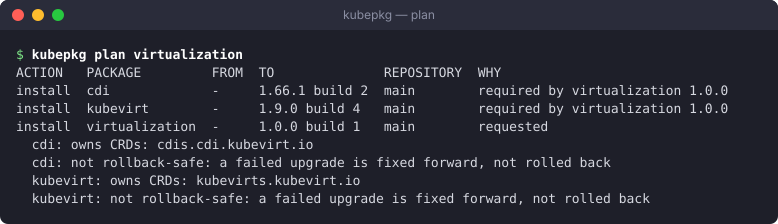

# kubepkg

kubepkg is a package manager for Kubernetes clusters. A cluster subscribes to package repositories. You ask it for packages by name and version constraint, and it installs each one together with what that package requires. Every change is recorded as a revision. When an upgrade fails, the whole package goes back to the revision before it if its author declared that safe.

Packages are built from upstream sources by the people who maintain the repository, much as Debian maintainers build `.deb` files from upstream tarballs. Release manifests, Helm charts and source archives all become ordinary Helm charts in an OCI registry. They are pinned by digest and listed in a signed index. Installing a package never reaches back to the upstream project.

## What it gives you

- **Packages with requirements.** A package requires other packages or capabilities, with semver constraints. It can also declare conflicts. `kubepkg install` resolves the requirements and shows the plan before it changes anything.
- **Whole-package revisions and rollback.** A package of three charts is upgraded as one unit. If the third chart fails, all three return to where they were. This happens only when the package's author says going back is safe.
- **Your own repositories.** You build packages from recipes, publish them to any OCI registry, and serve a signed index from any static web host. The trust model follows TUF: threshold signatures, key rotation, expiry, and protection against rollback and fork attacks.
- **CRD ownership.** A CRD belongs to exactly one package, so two packages cannot fight over it.
- **Distributions as packages.** A meta package lists the members of a distribution and their versions. Installing version 2 of the distribution upgrades every member to what version 2 asks for.
- **Works with the tools you have.** Components install through Helm in-process, through werf's deployment engine Nelm, through Flux, or through Argo CD. `kubepkg render` writes packages out for Flux, Argo CD or helmfile, so you can use them with no operator at all.
- **One hub, many clusters.** A hub installs sets of packages into clusters chosen by label.
- **Built to be adapted.** You can serve the types under your own API group and extend builds with plugins in any language. You can also import the operator and CLI as Go libraries.

## Where to start

- **[Quickstart](quickstart.md):** install kubepkg into a cluster and install your first package in five minutes.
- **[Concepts](concepts.md):** packages, revisions, repositories and recipes, and how they fit together.
- **[Building packages](guides/building.md):** turn an upstream project into a package in your own repository.
- **[Making a distribution](guides/distributions.md):** a curated set of components that installs and upgrades as one.

kubepkg needs nothing but its CRDs and its operator, so it runs on any conformant Kubernetes cluster. It is tested on Kubernetes 1.35 and 1.37 on kind, and on a cluster with a hosted control plane. The API is `v1`: it changes only in compatible ways, see [Compatibility](reference/compatibility.md).
