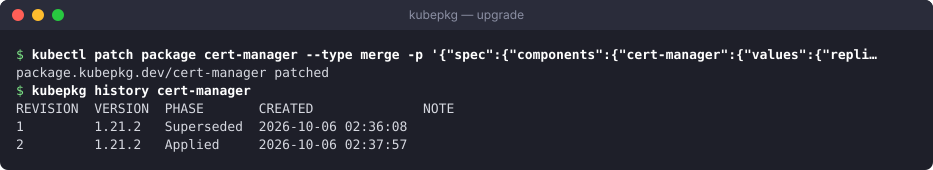

# Quickstart

In five minutes you will install kubepkg into a cluster and subscribe it to a package repository. Then you will install a package, change it, roll it back and remove it. You need a Kubernetes cluster, `kubectl`, and Helm 3.8 or newer.

The examples on this page are real output from a test cluster.

## 1. Install the CLI

Download the binary for your system from the [latest release](https://github.com/tym83/kubepkg/releases/latest) and check it against `SHA256SUMS`:

```bash
os=$(uname -s | tr A-Z a-z); arch=$(uname -m | sed 's/x86_64/amd64/;s/aarch64/arm64/')
curl -fsSLO "https://github.com/tym83/kubepkg/releases/latest/download/kubepkg-${os}-${arch}"
curl -fsSL https://github.com/tym83/kubepkg/releases/latest/download/SHA256SUMS | grep "kubepkg-${os}-${arch}" | shasum -a 256 -c -
install -m 0755 "kubepkg-${os}-${arch}" /usr/local/bin/kubepkg
```

The CLI talks to the cluster in your current kubeconfig context. To pick another one, pass `--context <name>`.

## 2. Install the operator

The operator does the installing. It ships as a Helm chart:

```bash
helm install kubepkg oci://ghcr.io/tym83/charts/kubepkg \
  --namespace kubepkg-system --create-namespace --wait
```

This creates the kubepkg CRDs and starts the operator. By default the operator installs charts with Helm, in-process. [Installing kubepkg](install.md) covers the other backends and the chart's settings.

## 3. Subscribe to a repository

A repository is a signed index of packages. The example repository is built from [tym83/kubepkg-recipes](https://github.com/tym83/kubepkg-recipes). Fetch its public key and add it:

```bash
curl -fsSLO https://raw.githubusercontent.com/tym83/kubepkg-recipes/main/keys/index.pub
```

```text
--8<-- "examples/repo-add.txt"
```

From now on the operator accepts this index only when the key has signed it. The operator refreshes the index every ten minutes. See what the repository offers:

```text
--8<-- "examples/search.txt"
```

## 4. Look before you install

`kubepkg plan` resolves a package and everything it requires against the cluster. It changes nothing. The output lists what would be installed, which CRDs each package would own, and the permissions each package needs. It also says whether each package can be rolled back:


`virtualization` is a meta package. It installs nothing itself and requires KubeVirt and CDI at matching versions. [Making a distribution](guides/distributions.md) explains how that works.

## 5. Install

`kubepkg install` shows the same plan and then writes one `Package` object per package. The operator does the rest:


When you name no version, a package follows patch releases of the newest version in the repository. You can name a constraint instead: `kubepkg install cert-manager@~1.21`.

## 6. Change, look at the history, roll back

Every change to a package makes a new revision. Here the number of cert-manager replicas changes:



Revision 1 is still recorded, so you can go back to it. A rollback adds a new revision instead of rewriting history:


Everything kubepkg knows lives in ordinary Kubernetes objects:

```text
--8<-- "examples/resources.txt"
```

## 7. Remove

```text
--8<-- "examples/remove.txt"
```

kubepkg refuses to remove a package while another installed package requires it. `--autoremove` also removes requirements that nothing needs any more. When a package is removed, the CRDs it owned stay in the cluster by default, and so do the objects of those types. Set `crdPolicy: Delete` on the Package to remove them as well.

## Next

- [Concepts](concepts.md): what a package, a revision and a repository are.
- [Installing and upgrading packages](guides/packages.md): values, variants, constraints, and everything else the commands above can do.
- [Building packages](guides/building.md): package your own software, or someone else's, into your own repository.
